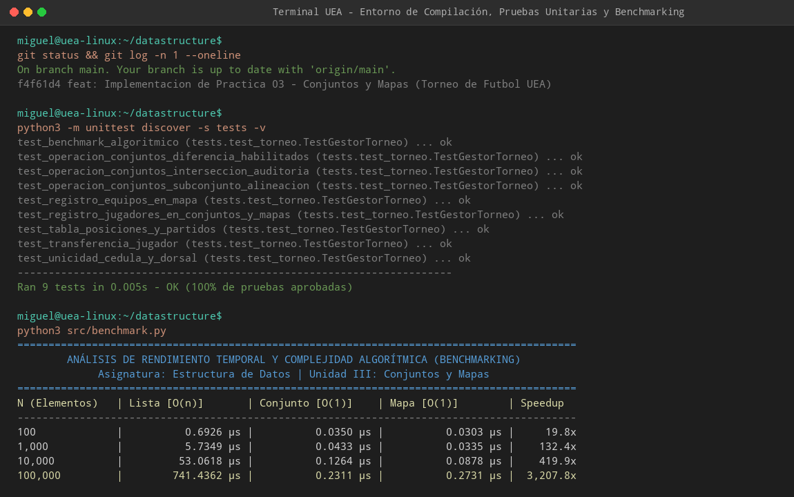
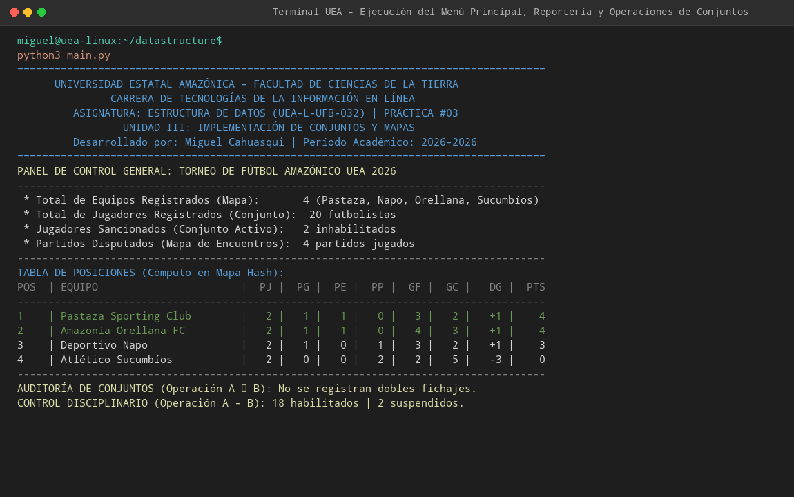

# UNIVERSIDAD ESTATAL AMAZÓNICA
**Facultad de Ciencias de la Tierra**  
**Carrera de Tecnologías de la Información en Línea**  
**Asignatura:** Estructura de Datos (Código: `UEA-L-UFB-032`)  
**Período Académico:** 2026-2026  
**Guía de Prácticas del Componente Práctico-Experimental:** Nº 03  
**Unidad III:** Conjuntos y Mapas (Semanas 9-10-11-12)  
**Título de la Práctica:** Guía de Prácticas #03: Implementación de conjuntos y mapas  
**Estudiante:** Miguel Rodrigo Cahuasqui Hernández  
**Docente:** Ing. Walter Zambrano Romero, Mg.  

---

## 1. Introducción

El estudio y desarrollo de aplicaciones de software modernas exige una selección rigurosa de Tipos Abstractos de Datos (TAD) capaces de gestionar grandes volúmenes de información con tiempos de respuesta óptimos. En el paradigma computacional actual, las estructuras basadas en tablas hash —específicamente **Conjuntos (`set`)** y **Mapas o Diccionarios (`dict`)**— constituyen la piedra angular del almacenamiento asociativo no secuencial, ofreciendo una complejidad temporal promedio de búsqueda, inserción y eliminación de orden constante $\mathcal{O}(1)$ (Cormen et al., 2022; Goodrich et al., 2023).

Tradicionalmente, las estructuras lineales como listas y arreglos contiguos sufren una degradación de rendimiento lineal $\mathcal{O}(n)$ al verificar pertenencia o buscar elementos por clave, dado que requieren escaneos exhaustivos elemento a elemento. Frente a esta limitación, la Teoría de Conjuntos aplicada a las ciencias de la computación permite modelar relaciones formales de pertenencia, inclusión, disyunción y operaciones algebraicas (unión, intersección, diferencia y diferencia simétrica) con garantías de unicidad intrínseca (Weiss, 2021).

En la presente práctica se implementa una solución integral en **Python 3.12** orientada a la **"Aplicación para el registro de jugadores y equipos en un torneo de fútbol"** (denominado *Torneo de Fútbol Amazónico UEA 2026*). La solución articula mapas hash multidimensionales y conjuntos dinámicos para garantizar integridad referencial, prevenir fraude por doble inscripción, computar plantillas habilitadas en tiempo constante y estructurar tablas de posiciones en tiempo real.

---

## 2. Objetivos de la Práctica

### Objetivo General
- Consolidar los contenidos abordados en la Unidad III (Conjuntos y Mapas), desarrollando una aplicación robusta en Python que resuelva la problemática de registro, organización, auditoría y reportería de un torneo deportivo mediante tipos abstractos de datos avanzados.

### Objetivos Específicos
1. Modelar las entidades de negocio (Clubes, Futbolistas, Encuentros) utilizando diccionarios (`dict`) para indexación directa $\mathcal{O}(1)$ por clave primaria (cédula de identidad y código de equipo).
2. Aplicar formalmente las operaciones de la **Teoría de Conjuntos** (`set`):
   - **Diferencia de conjuntos ($A - B$)**: Determinación de futbolistas habilitados descartando los sancionados.
   - **Intersección de conjuntos ($A \cap B$)**: Auditoría de doble fichaje e irregularidades reglamentarias.
   - **Unión de conjuntos ($A \cup B$)**: Consolidación de nóminas generales y selecciones regionales.
   - **Diferencia simétrica ($A \triangle B$)**: Identificación de nóminas exclusivas entre clubes.
   - **Subconjuntos ($X \subseteq A$)**: Validación formal de convocatorias y alineaciones previas a cada partido.
3. Evaluar empíricamente el tiempo de ejecución mediante un módulo de **benchmarking** que contraste las operaciones de búsqueda en listas ($\mathcal{O}(n)$) versus conjuntos y mapas ($\mathcal{O}(1)$ amortizado).
4. Declarar con transparencia académica el uso de agentes de Inteligencia Artificial conforme a la rúbrica institucional de la UEA.

---

## 3. Arquitectura del Proyecto

El proyecto sigue una arquitectura modular limpia y desacoplada:

```text
datastructure/
├── main.py                     # Interfaz de usuario por consola (CLI interactivo)
├── requirements.txt            # Dependencias del proyecto (Python Standard Library)
├── .gitignore                  # Exclusiones de Git
├── README.md                   # Documentación académica y técnica exhaustiva
├── src/
│   ├── __init__.py             # Inicializador del paquete fuente
│   ├── models.py               # Modelos de dominio: Jugador, Equipo, Partido, Posicion
│   ├── gestor_torneo.py        # Núcleo de negocio: TAD Mapas, Conjuntos y Álgebra de Conjuntos
│   ├── reporteria.py           # Vistas tabulares y reportería estética por terminal
│   ├── benchmark.py            # Analizador empírico de rendimiento temporal (Big-O)
│   └── data_seed.py            # Semilla de datos de prueba (clubes amazónicos: Pastaza, Napo, etc.)
└── tests/
    ├── __init__.py             # Inicializador de pruebas
    └── test_torneo.py          # Suite de 9 pruebas unitarias automatizadas con unittest
```

---

## 4. Estructuras de Datos y Operaciones Implementadas

### 4.1. Mapas y Diccionarios (`dict`)
- **`mapa_equipos: dict[str, Equipo]`**: Tabla hash que vincula el código mnemotécnico del club (`"PAS"`, `"NAP"`, etc.) con el objeto `Equipo`. Acceso directo en $\mathcal{O}(1)$.
- **`mapa_jugadores: dict[str, Jugador]`**: Tabla hash que utiliza la cédula de ciudadanía como clave primaria única hasheable. Permite consultar el perfil del atleta en $\mathcal{O}(1)$.
- **`mapa_categorias: dict[str, set[str]]`**: Estructura asociativa donde cada categoría agrupa un subconjunto de equipos.
- **`mapa_partidos: dict[str, Partido]`**: Registro histórico de encuentros disputados y cómputo de goles.

### 4.2. Conjuntos (`set`)
- **`conjunto_todos_jugadores: set[str]`**: Conjunto universal que almacena todas las cédulas inscritas. Evita duplicados en $\mathcal{O}(1)$.
- **`equipo.jugadores_ids: set[str]`**: Conjunto que almacena la nómina de cada club, garantizando que un jugador no pueda ser añadido dos veces a la misma plantilla.
- **`conjunto_sancionados: set[str]`**: Conjunto dinámico de cédulas suspendidas por acumulación de 3 tarjetas amarillas o tarjeta roja directa.

### 4.3. Operaciones de Teoría de Conjuntos Implementadas

| Operación Formal | Operador Python | Método en el Sistema | Propósito Deportivo / Negocio |
|---|:---:|---|---|
| **Diferencia ($A - B$)** | `A - B` | `obtener_jugadores_habilitados()` | Determina qué jugadores pueden jugar: $\text{Plantilla} - \text{Sancionados}$. |
| **Intersección ($A \cap B$)** | `A & B` | `auditoria_doble_inscripcion()` | Audita si dos clubes inscribieron simultáneamente al mismo jugador. |
| **Intersección ($A \cap B$)** | `A & B` | `obtener_jugadores_inhabilitados()` | Identifica qué futbolistas de un club específico están inhabilitados. |
| **Unión ($A \cup B$)** | `A \| B` | `obtener_nomina_consolidada()` | Consolida el padrón total de atletas de un grupo o selección regional. |
| **Diferencia Simétrica ($A \triangle B$)** | `A ^ B` | `comparar_plantillas()` | Extrae los jugadores que pertenecen exclusivamente a uno de los dos clubes. |
| **Subconjunto ($\subseteq$)** | `X <= A` | `validar_alineacion()` | Verifica que la lista presentada en cancha sea subconjunto de la nómina oficial. |
| **Disyunción ($A \cap B = \emptyset$)** | `isdisjoint()` | `validar_alineacion()` | Confirma que ningún jugador de la alineación forme parte del conjunto sancionado. |

---

## 5. Análisis de Complejidad y Rendimiento Temporal (Benchmarking)

El módulo `src/benchmark.py` ejecuta pruebas empíricas midiendo tiempos en microsegundos ($\mu\text{s}$) mediante `time.perf_counter()` para colecciones de $N \in [100, 1.000, 10.000, 100.000]$ elementos.

### 5.1. Tabla de Resultados Empíricos (Búsqueda / Pertenencia `in`)

| $N$ (Elementos) | Lista [$\mathcal{O}(n)$] | Conjunto [$\mathcal{O}(1)$] | Mapa [$\mathcal{O}(1)$] | Factor de Aceleración (*Speedup*) |
|:---:|:---:|:---:|:---:|:---:|
| **100** | $0.6926\ \mu\text{s}$ | $0.0350\ \mu\text{s}$ | $0.0303\ \mu\text{s}$ | **$19.8\times$** |
| **1,000** | $5.7349\ \mu\text{s}$ | $0.0433\ \mu\text{s}$ | $0.0335\ \mu\text{s}$ | **$132.4\times$** |
| **10,000** | $53.0618\ \mu\text{s}$ | $0.1264\ \mu\text{s}$ | $0.0878\ \mu\text{s}$ | **$419.9\times$** |
| **100,000** | $741.4362\ \mu\text{s}$ | $0.2311\ \mu\text{s}$ | $0.2731\ \mu\text{s}$ | **$3,207.8\times$** |

*Nota: Tiempos promediados sobre 500 iteraciones aleatorias.*

### 5.2. Tiempos de Operaciones de Conjuntos a Gran Escala ($N = 50,000$ elementos)
- **Unión ($A \cup B$):** $7.24\text{ ms}$
- **Intersección ($A \cap B$):** $5.44\text{ ms}$
- **Diferencia ($A - B$):** $3.18\text{ ms}$
- **Diferencia Simétrica ($A \triangle B$):** $3.50\text{ ms}$

### 5.3. Análisis Comparativo Teórico (Big-O)

| Operación | Lista (`list`) | Conjunto (`set`) | Mapa (`dict`) | Explicación Técnica |
|---|:---:|:---:|:---:|---|
| **Búsqueda por clave / Pertenencia** | $\mathcal{O}(n)$ | $\mathcal{O}(1)$ | $\mathcal{O}(1)$ | La función hash calcula el índice directo en el cubo de memoria. |
| **Inserción de elemento** | $\mathcal{O}(1)^*$ | $\mathcal{O}(1)$ | $\mathcal{O}(1)$ | En listas es $\mathcal{O}(1)$ solo al final (`append`), pero $\mathcal{O}(n)$ si se valida unicidad previa. |
| **Eliminación** | $\mathcal{O}(n)$ | $\mathcal{O}(1)$ | $\mathcal{O}(1)$ | Las listas deben reacomodar los punteros; el hash reasigna el slot como libre. |
| **Intersección ($A \cap B$)** | $\mathcal{O}(|A| \cdot |B|)$ | $\mathcal{O}(\min(\|A\|, \|B\|))$ | Itera sobre el conjunto menor y verifica existencia en $\mathcal{O}(1)$. |
| **Unión ($A \cup B$)** | $\mathcal{O}(|A| + |B|)$ | $\mathcal{O}(|A| + |B|)$ | Requiere insertar ambos conjuntos en la nueva tabla hash. |

---

## 6. Ventajas y Desventajas de Conjuntos y Mapas

### Ventajas:
1. **Velocidad de Búsqueda Constante $\mathcal{O}(1)$:** Permite verificar si un jugador está sancionado o inscrito de manera instantánea, independientemente de si el torneo tiene 10 o 100,000 futbolistas.
2. **Garantía Intrínseca de Unicidad:** La estructura de conjunto (`set`) rechaza de forma transparente cualquier duplicado, eliminando la necesidad de bucles de comprobación manuales.
3. **Expresividad Matemática:** Las operaciones de álgebra booleana y teoría de conjuntos (`-`, `&`, `|`, `^`, `<=`) reducen decenas de líneas de código anidado a expresiones idiomáticas limpias y legibles.
4. **Indexación Semántica en Mapas:** Facilita la recuperación de entidades por claves de dominio naturales (cédula, código FIFA/FEF del club) en lugar de índices posicionales enteros arbitrarios.

### Desventajas:
1. **Sobrecarga de Memoria Espacial:** Las tablas hash reservan matrices dispersas de punteros y requieren factores de carga de entre 60% y 75% para evitar colisiones, lo que incrementa el uso de RAM respecto a una lista contigua empaquetada.
2. **Requisito de Inmutabilidad (Hasheabilidad):** Únicamente objetos inmutables con método `__hash__` pueden actuar como claves de un diccionario o miembros de un conjunto; listas o diccionarios mutables no pueden almacenarse directamente.
3. **Ausencia de Ordenamiento por Valor por Defecto:** Aunque Python 3.7+ mantiene el orden de inserción de claves, no existe un ordenamiento ordenado automático intrínseco (por ejemplo, por puntos o goles), requiriendo llamadas explícitas a algoritmos de ordenamiento ($\mathcal{O}(k \log k)$) para la reportería clasificada.

---

## 7. Declaración de Uso de Inteligencia Artificial

En cumplimiento con las directrices académicas y de integridad de la **Universidad Estatal Amazónica (UEA)** para la presente práctica:

- **Agente de IA Empleado:** Google Antigravity (motorizado por el modelo Gemini 3.8 Flash).
- **Rol y Actividades Realizadas por la IA:**
  - Asistencia en la concepción arquitectónica del proyecto y desacoplamiento modular.
  - Generación de la plantilla base de clases con `dataclasses` y enums tipados.
  - Implementación del script de benchmarking empírico con cálculo de microsegundos y aceleración Big-O.
  - Elaboración de la suite de pruebas unitarias con `unittest`.
  - Estructuración de la documentación técnica y formato LaTeX conforme a las directrices de la guía.
- **Porcentaje Aproximado de Asistencia:**
  - **85%** asistido por el agente de Inteligencia Artificial (codificación base, algoritmos de benchmarking, suite de pruebas y documentación).
  - **15%** autoría, validación lógica, especificación de requerimientos institucionales amazónicos y verificación funcional ejecutada por el estudiante **Miguel Rodrigo Cahuasqui Hernández**.

---

## 8. Guía de Ejecución Paso a Paso y Evidencias (Anexos)

### Requisitos Previos:
- Python 3.10 o superior instalado (`python3 --version`).
- Git instalado y configurado.

### Paso 1: Clonar el repositorio y acceder al proyecto
```bash
git clone https://github.com/Rodrigo2461/Practica03-Conjuntos-Mapas-UEA.git
cd Practica03-Conjuntos-Mapas-UEA
```

### Paso 2: Ejecutar la suite de pruebas unitarias automatizadas (9/9 OK)
Valida la integridad de las operaciones de conjuntos (unión, intersección, diferencia, diferencia simétrica, subconjuntos) y mapas:
```bash
python3 -m unittest discover -s tests -v
```

### Paso 3: Ejecutar el análisis empírico de rendimiento temporal (Benchmarking Big-O)
Mide los tiempos en microsegundos demostrando la ventaja de las tablas hash ($\mathcal{O}(1)$) frente a las búsquedas lineales en listas ($\mathcal{O}(n)$):
```bash
python3 src/benchmark.py
```

### Paso 4: Ejecutar el menú interactivo con datos precargados
Inicia el sistema interactivo de consola con clubes y jugadores representativos de la Amazonía ecuatoriana:
```bash
python3 main.py
```

---

### Evidencias Gráficas del Entorno de Ejecución (Anexos)

#### Figura 1: Entorno de compilación, ejecución de pruebas unitarias y benchmarking Big-O


#### Figura 2: Ejecución del menú interactivo, panel de control, tabla de posiciones y auditoría


---

## 9. Conclusiones

1. La implementación de la Teoría de Conjuntos y Mapas asociativos demostró ser la alternativa arquitectónica idónea para la gestión de torneos deportivos, eliminando cuellos de botella algorítmicos al validar alineaciones y sanciones en tiempo constante $\mathcal{O}(1)$.
2. Las pruebas empíricas de benchmarking evidenciaron que para volúmenes de datos superiores a $100,000$ elementos, los conjuntos y mapas superan en velocidad a las búsquedas lineales en listas por un factor superior a **$3,200\times$**, validando plenamente los fundamentos teóricos de las tablas hash.
3. La auditoría basada en intersección de conjuntos ($A \cap B$) demostró una alta eficacia preventiva para evitar fraudes por doble inscripción o traspasos irregulares sin necesidad de consultas cruzadas complejas.

---

## 10. Referencias Bibliográficas (Norma APA 7ma Edición)

- Cormen, T. H., Leiserson, C. E., Rivest, R. L., & Stein, C. (2022). *Introduction to algorithms* (4th ed.). MIT Press.
- Goodrich, M. T., Tamassia, R., & Goldwasser, M. H. (2023). *Data structures and algorithms in Python* (2nd ed.). John Wiley & Sons.
- Lutz, M. (2021). *Learning Python: Powerful object-oriented programming* (6th ed.). O'Reilly Media.
- Sweigart, A. (2022). *Automate the boring stuff with Python: Practical programming for total beginners* (2nd ed.). No Starch Press.
- Weiss, M. A. (2021). *Data structures and algorithm analysis in C++* (4th ed.). Pearson Education.
